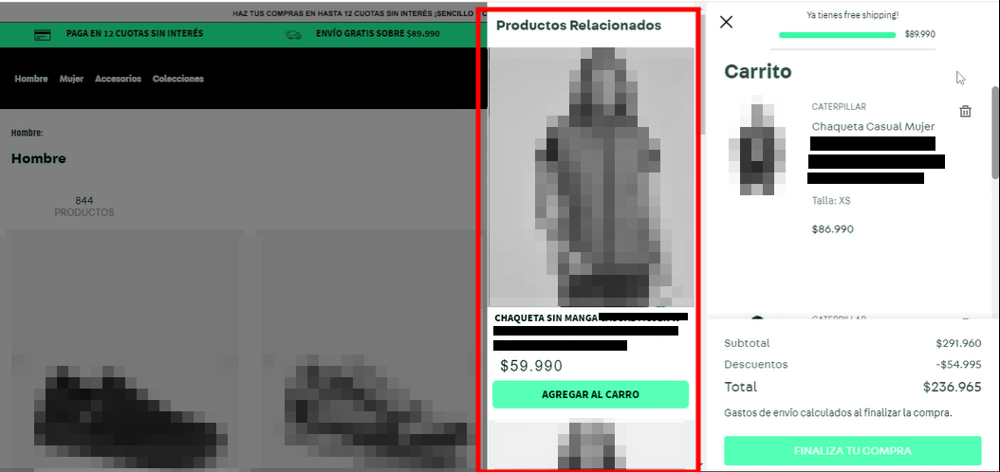

# vtex-minicart-related
VTEX React Store Theme app built to display a product shelf based on the minicart contents.



## Requirements:
- An working VTEX environment
- A functional VTEX Store Theme
- Products registered in VTEX Catalog with similars, accessories, etc., for better performance

## How to install:
Inside the `/react` directory, place the directories (and their respective contents) `/components/MinicartRelated` ; `react/utils` ; and `/styles/components/MinicartRelated`. And finally, put the `MinicartRelated.js` file in `/react`.
In `/store/interfaces.json` file, add the following block:

``` js
"MinicartRelated": {
    "component": "MinicartRelated",
    "required": ["product-summary"]
}
```

Also, make sure that the root `manifest.json` file includes the following dependencies:

```
vtex.order-manager
vtex.styleguide
vtex.native-types
vtex.product-list-context
vtex.device-detector
vtex.product-list-context
vtex.render-runtime
vtex.css-handles
vtex.product-summary
vtex.pixel-manager
```

## How to use:
First of all, whether in `/store/blocks.json` or any other Store Theme file, declare the `MinicartRelated` block as follows (comments included for better guidance): 

``` js
{
    "MinicartRelated": {
      "blocks": ["product-summary.shelf"], // must include at least one product-summary.shelf
      "props": {
        "blockClass": ["related-slider", "product"], // optional
        "isEnabled": true, // boolean to enable or disable the feature
        "recommendation": "editor.relatedProducts.view", // recommendation type
        "productList": { // configuration similar to VTEX IO's product-summary.shelf
          "maxItems": 5,
          "showTitle": true,
          "titleText": "Related products",
          "summary": {
            "showBadge": true,
            "badgeText": "OFF",
            "showCollections": false,
            "showListPrice": true,
            "showLabels": true,
            "showInstallments": false,
            "showSavings": false,
            "name": {
              "showBrandName": false,
              "showSku": false,
              "showProductReference": false
            }
          }
        }
      }
    }
}
```

More specifically, inside the IO `drawer` block of the Minicart (where the minicart header and footer are defined), include the `minicart-related` block as well.